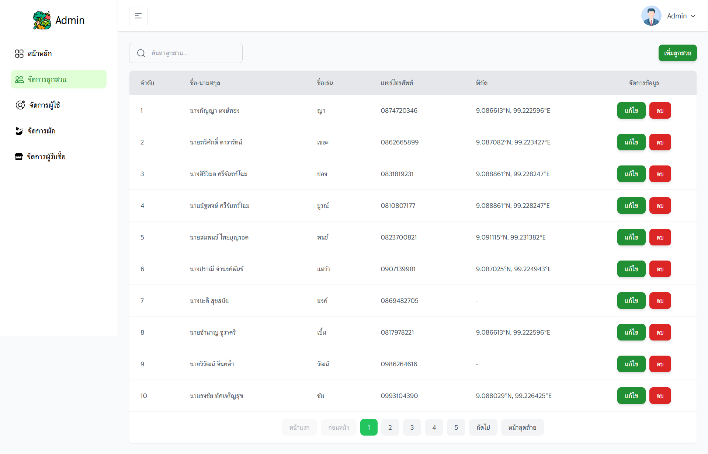

## 🖼️ Screenshots

### 🧑‍🌾 หน้า Dashboard (แดชบอร์ดผู้ดูแล)

หน้านี้เป็นการLoginเข้าระบบ

---

### 📝 หน้าแรก (หน้าแรก)

  
  

หน้าแรก แสดงว่าลูกสวนอยู่ที่ไหน และเมื่อกดจะแสดงผลผลิตของลูกส่วนคนนั้นๆ top 3

---

### 👩‍🌾 หน้าทำนายและจัดการสั่งปลูก (predict&manage)

ทำนายว่าผลผลิตที่ต้องการ ใครบ้างที่ควรปลูกและต้องปลูกคนละกี่กิโลกรัม

---

### 👩‍🌾 หน้าจัดการข้อมูลOrder (Management)

จัดข้อมูลOrderการสั่งปลูก

---

### 👩‍🌾 หน้าdashboardของเจ้าหน้าที่ (Admin_dashboard)

แสดงข้อมูลต่างๆ เช่น ผลผลิต จำนวนลูกสวน ผู้รับซื้อ รายการการสั่งผลผลิต

---

### 👩‍🌾 หน้าจัดการลูกสวนของเจ้าหน้าที่ (Admin_farmer)

แสดงข้อมูลของลูกสวน และ สามารถแก้ไข ลบได้

---

### 👩‍🌾 หน้าจัดการผู้ใช้ของเจ้าหน้าที่ (Admin_user)

แสดงข้อมูลของผู้ใช้ และ สามารถแก้ไข ลบได้

---

### 👩‍🌾 หน้าจัดการผักของเจ้าหน้าที่ (Admin_vegetable)

แสดงข้อมูลของผัก และ สามารถแก้ไข ลบได้

---

### 👩‍🌾 หน้าจัดการผักของเจ้าหน้าที่ (Admin_buyer)

แสดงข้อมูลของผู้รับซื้อ และ สามารถแก้ไข ลบได้

